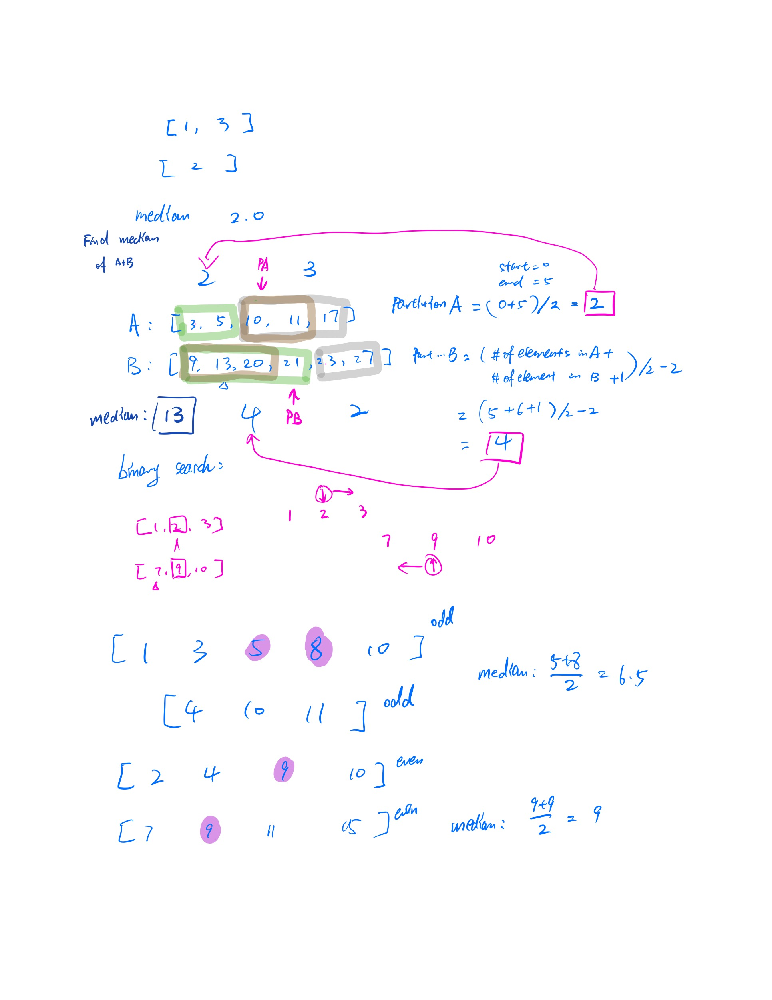
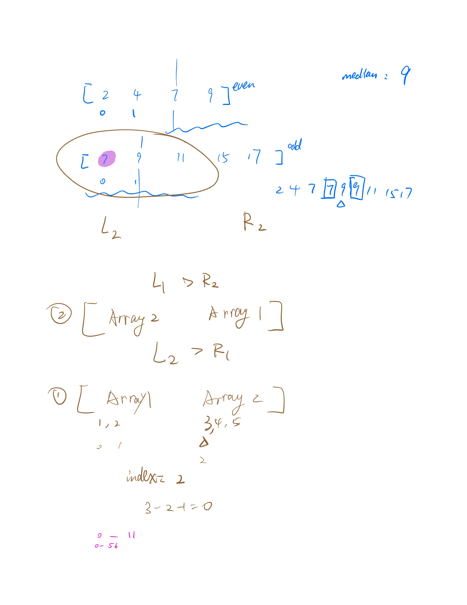
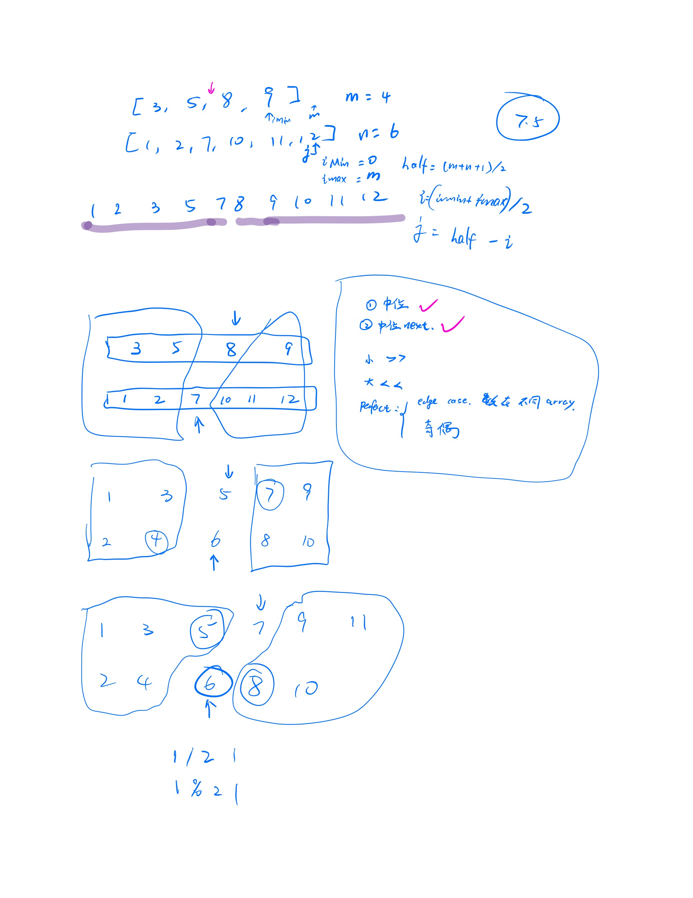
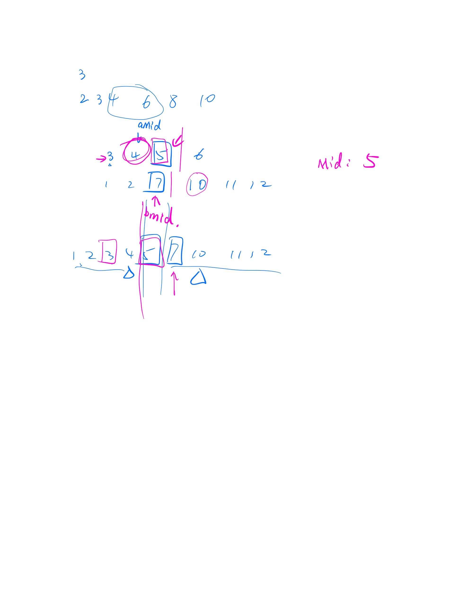

# 每一题的核心知识点
### Jumping On Cloud
- Problem Description: Given an array of clouds(`0` and `1`), person can jump `1` or `2` per time. Finding the minimum
jumps
- Concept: Applying `dynamic programming`
### Two Sum
- Problem Description: we are looking for the indexes of two number which sum is the targets input.
- Concept: use `HashMap` to preload the given number data and its supplement. Which will get the
values in constant time.
### Add Two Numbers
- Problem Description: given two `linked list` numbers, finding the sum as another linked list
- Concept: recursively call the method to add each digit, once need to carry `1`, first take care of
the digit where overflowed, then add a node of 1 to the next node
### Longest Substring Without Repeating Characters
- Problem Description: as title said
- Concept: the key is to send alert once find the overlapped sequence, since it's finding the non-overlapped sequence,
we can use a set which will have no overlapped elements rather than list all possibilities
### Median Of Two Sorted Arrays
- Problem Description: as title said, The `overall run time complexity should be O(log (m+n))`,
once we have `log` then it's has high probability of a varsity of `binary search`
+ Concept: In this problem, we divide each array by `half`, since each array is `sorted`, the first half will always
less than the second part, we set the shorter array always be the first array A, compare the middle element, if big move
the ptr left by one for in the shorter array. If small move right in shorter array. Once all the elements on the left of
ptr is less than or equal to the elements on the right. We can say that we've almost found median. If the new combined
array has `odd` numbers of elements, the median will be the `maximum of the left part` of the ptr. If it has `even` number of
elements, we have edge cases that these two numbers might in `different arrays` in origin,
either far right or far left, or normal case that it's in same array.
    1. Right of shorter array, which means all array A is less than array B
    2. i point to 0, then A is empty, maxLeft will be mid of B
    3. j point to 0, then B is empty, maxLeft will be mid of A
    4. normal case: 2 arrays will be divides into 2 parts
   
   
   
   
