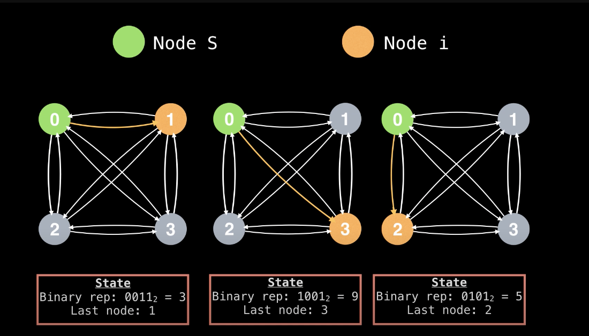

# pesudocode

```python
# finds the minimum TSP tour cost.
# m - 2D adjacency matrix representing graph
# S - The start node (0 <= S < N)
def tsp(m, s):
    N = matrix.size

    # initialize memo table
    # fill table with null values or +inf
    memo = 2d table of size N x 2^N

    setup(m, memo, S, N)
    solve(m, memo, S, N)
    minCost = findMinCost(m, memo, S, N)
    tour = findOptimalTour(m, memo, S, N)

    return (minCost, tour)
```

```python
# Initializes the memo table by caching the optimal solution from the start
# node to every other node
def setup(m, memo, S, N):
    for (i= 0; i<N; i=i+1):
        if i == S: continue

    # store the optimal value from node S to each node i (this is given as input
    # in the adjacency matrix m)
    memo[i][1 << S | 1 << i] = m[S][i]
```

 <!-- source: https://www.youtube.com/watch?v=cY4HiiFHO1o -->

```python
def solve(m, memo, S, N):
    for (r = 3; r<=N; r++):
        # The combinations function generates all bit sets of size N with r bits
        # set to 1. For example, combinations(3,4) = {0111_2, 1011_2, 1101_2, 1110_2}, _2 for binary
        for subset in combinations(r,N):
            if notIn(S, subsset): continue

            for (next = 0; next < N; next = next+1):
                if next == S || notIn(next, subset): continue
            # The subset state without the next node
            state = subset ^ (1 << next)
            minDist = +inf

            # `e` is short for end node
            for (e = 0; e< N; e = e+1):
                if e == S || e == next || notIn(e, subset):
                    continue

                newDistance = memo[e][state] + m[e][next]

                if (newDistance < minDist):
                    minDist = newDistance
            memo[next][subset] = minDist

    # returns true if the ith bit in `subset` is not set
    def notin(i, subset):
        return ((1<<i) & subset) == 0


```

```python
# Generate all bit sets of size n with r bits set to 1.
def combinations(r, n):
    subsets = []
    combinations(0, 0, r, n, subsets)
    return subsets

# Recursive method to generagte bit sets.
def combinations(set, at r, n subsets):
    if r == 0:
        subsets.add(set)
    else:
        for ( i =  at; i < n i = i+1):
            # Flip on ith bit
            set = set | (1 << i)

            combinations(set, i + 1, r-1, n, subsets)

            # backtrack and flip off ith bit
            set = set & ~(1 << i)
```

```python
def findMinCost(m, memo, S, N):
    # The end state is the bit mask with
    # N bits set to 1 (equivalently 2^N - 1)
    END_STATE = (1 << N) - 1

    minTourCost = +inf

    for (e = 0; e < N; e = e + 1):
        if e == S: continue

        tourCost = memo[e][END_STATE] + m[e][S]
        if tourCost < minTourCost:
            minTourCost = tourCost

    return minTourCost
```

```python
def findOptimalTour(m, memo, S, N):
    lastIndex = S
    state = (1<<N) - 1; # END_STATE
    tour = array of size N+1

    for (i = N-1; i >=1; i--):
        index = -1  # track the best node
        for (j = 0; j< N; j++):
            if j == S || notIn(j, state): continue
            if index == -1: index = j
            prevDist = memo[index][state] + m[index][lastIndex]
            newDist = memo[j][state] + m[j][lastIndex]

            if (newDist < prevDist): index = j

        tour[i] = index
        state = state ^ (1 << index)  # flip the bit at index
        lastIndex = index

    tour[0] = tour[N] = S
    return tour
```
